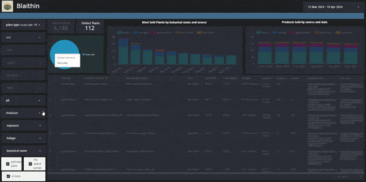

# blaithin

You can find the dashboard [here](https://lookerstudio.google.com/reporting/004c1328-5006-4d28-9aa2-2feafd76e941)

# Goal of blaithin
The motivation behind this project was to provide gardeners and aspiring gardeners in Ireland with a simplified tool for facilitating plant selection for their gardens. 

Gardening is a fantastic hobby which comes with a wealth of benefits. However, it can be daunting for beginners to understand where to start. They may not select plants which are ideal for their space. They may purchase a plant which requires a very specific type of soil (ericaceous etc) or which will grop too big for their space. 

There is also a vast differential in prices across the main nurseries in Ireland. The same product in 1 nursery may be over twice the price in another nursery for comparable quality and size. 

As someone who is passionate about gardening, I find the process of buying new plants very frustrating. I research new plants/ideas on a number of different websites. With my selections in mind, I then have search through many known nurseries which deliver to my location to determine which has the best pricing including delivery fees (which can be up to €60 in some cases).

# Future Plans for blaithin
For now, we are parsing data manually to understand sizing, quantity and categorisation. This would be a great candidate for machine learning. 

# Build Instructions
Find them [here](BUILD.md)

# Tools:
### 1. Web Scraping
In another [repo](https://github.com/aburnsy/blaithin_files), we have our web scraping scripts. These use Selenium, beautiful soup and requests_html to scrape data from the RHS website and Irish nursery sites
### 2. Cloud
GCS - We use Google Cloud Storage for storing staging parquet files, Big Query as our Data Warehouse and Looker Studio for BI.
### 3. IaC
Terraform is used to spin up all necessary GCS assets
### 4. Workflow Orchestration
Mage AI is used to orchestrate pipelines
### 5. Data Processing
DBT is used to orchestrate transformation of data in Big Query.
We use Levenshtein distance from rapidfuzz to match plant data from RHS to product data from the scraped Irish nursery sites.