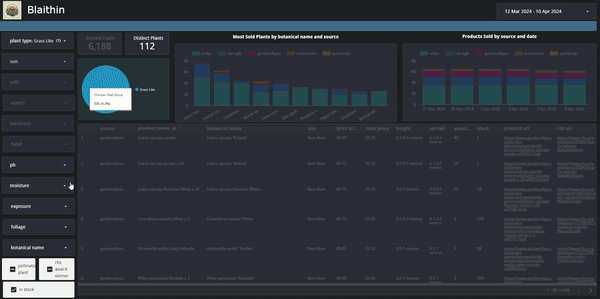

# blaithin

You can find the dashboard [here](https://lookerstudio.google.com/reporting/004c1328-5006-4d28-9aa2-2feafd76e941)

# Goal of Blaithin
The motivation behind this project was to provide gardeners and aspiring gardeners in Ireland with a simplified tool for facilitating plant selection for their gardens. 

Gardening is a fantastic hobby which comes with a wealth of benefits. However, it can be daunting for beginners to understand where to start. They may not select plants which are ideal for their space. They may purchase a plant which requires a very specific type of soil (ericaceous etc) or which will grop too big for their space. 

There is also a vast differential in prices across the main nurseries in Ireland. The same product in 1 nursery may be over twice the price in another nursery for comparable quality and size. 

As someone who is passionate about gardening, I find the process of buying new plants very frustrating. I research new plants/ideas on a number of different websites. With my selections in mind, I then have search through many known nurseries which deliver to my location to determine which has the best pricing including delivery fees (which can be up to €60 in some cases).



# Future Plans for Blaithin
For now, we are parsing data manually to understand sizing, quantity and categorisation. This would be a great candidate for machine learning. 

# Build Instructions

# Assumptions
* terraform cli is installed
* docker can be run locally
* google auth uses local json file

Please note that I ran this on a Windows machine only. If some part of this script does not work on Mac/Linux, please let me know.

### 1. Optional create a .env file in the root directory
This will prevent the need to pass in variables to the Terraform script.
The .env file should have the following structure
```bash
TF_VAR_GCP_PROJECT=google_project_name
TF_VAR_GCP_REGION=us-central1
TF_VAR_GCP_BUCKET_LOCATION=US
```

### 2. Add your google account key
Add your google account key under config folder and name it 'account_key.json'.
This is used not only by the Terraform scripts but by DBT and Mage data loaders and exporters.

### 3. Run build.sh
This will run the terraform scripts under the Terraform folder.
```bash
./build.sh
```

### 4. Run start.sh
This will build the docker image and containers and start the same containers.
Once Mage starts up, 2 tasks will kick off to load source data and export to staging tables in Cloud Storage.
```bash
./start.sh
```


# Stop and destroy
To stop the running containers, run 
```bash
./stop.sh
```
To destroy the Terraform infra, run
```bash
./destroy.sh
```